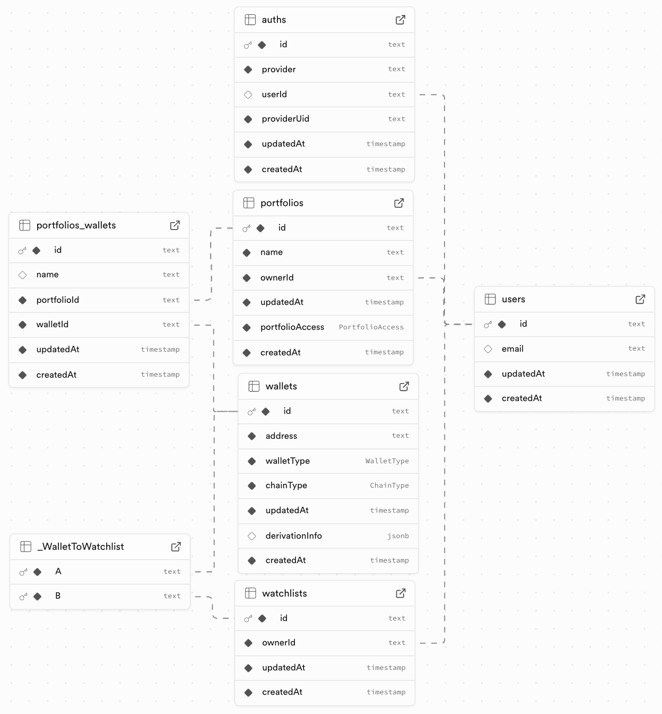
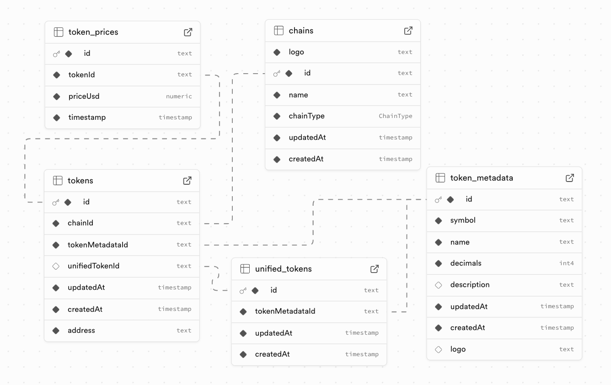

# Database Schema

This document outlines the database schema for the NextNonce backend. The schema is defined and managed using [Prisma](https://www.prisma.io/ "null"), which serves as the single source of truth for data models.

While the underlying database is PostgreSQL, the models are defined in a database-agnostic way. This abstraction is key to this architecture, as it allows for potential migration to other supported databases (like CockroachDB, MySQL, MongoDB, etc.) in the future without altering the application's data access logic. The types defined in `schema.prisma` are what matters, not the specific PostgreSQL column types.

The schema is logically divided into two main parts:

1. **User, Portfolio, and Wallet Data**: Manages user accounts, their portfolios, and the wallets they track.
    
2. **Chain, Token, and Market Data**: Stores information about blockchains, tokens, and their market prices.
    

## 1. User, Portfolio, and Wallet Data

This part of the schema is centered around the `User` and the entities they own and manage within the application.

### Model Explanations

#### `Auth`

- **Purpose**: Stores user authentication credentials. This model is crucial for decoupling the application from any single authentication provider. A new `Auth` record is created when a user signs up, linking their external authentication method (the `provider`, e.g., Supabase) to an internal `User` record.
    
- **Key Fields**:
    
    - `provider`: The name of the authentication service (e.g., "supabase-email").
        
    - `providerUid`: The user's unique identifier from the external auth provider.
        
- **Relations**:
    
    - Has a one-to-one relationship with `User`. A user has one auth record, and an auth record belongs to one user. The `onDelete: Cascade` ensures that if a `User` is deleted, their associated `Auth` record is also removed. This design means we are not coupled to the auth provider's ID system; internal `User.id` is the primary identifier, allowing us to change auth providers in the future with minimal friction.
        

#### `User`

- **Purpose**: The central model representing an application user.
    
- **Key Fields**:
    
    - `id`: The primary unique identifier for a user within the system.
        
    - `email`: The user's email address.
        
- **Relations**:
    
    - Has a one-to-one relationship with `Auth`.
        
    - Has a one-to-one relationship with `Watchlist`.
        
    - Has a one-to-many relationship with `Portfolio` (a user can own multiple portfolios).
        

#### `Portfolio`

- **Purpose**: Represents a user-created collection of wallets. This is the primary organizational unit for tracking assets. The schema supports a user having multiple portfolios, allowing for flexible asset organization (e.g., "DeFi", "Long-term", "Trading").
    
- **Note**: While the backend and schema support multiple portfolios per user, the mobile application currently implements a single default portfolio for simplicity.
    
- **Key Fields**:
    
    - `name`: A user-defined name for the portfolio (e.g., "DeFi Holdings", "Trading Wallet").
        
    - `portfolioAccess`: An enum (`PRIVATE`, `PUBLIC`, `UNLISTED`) that controls the visibility of the portfolio.
        
- **Relations**:
    
    - Belongs to one `User` (the owner). `onDelete: Cascade` ensures that deleting a user also deletes all of their portfolios.
        
    - Has a one-to-many relationship with `PortfolioWallet` (a portfolio can contain links to many wallets).
        

#### `Wallet`

- **Purpose**: Represents a unique blockchain wallet, identified by its address. This is a globally unique entity.
    
- **Key Fields**:
    
    - `address`: The wallet's public address (e.g., `0x...`). This is the primary unique identifier.
        
    - `walletType`: An enum (`SIMPLE` for EOA, `SMART` for smart contract wallets).
        
    - `chainType`: An enum (`EVM`, `CAIROVM`, etc.) indicating the wallet's underlying blockchain technology.
        
- **Relations**:
    
    - Has a many-to-many relationship with `Portfolio` via the `PortfolioWallet` join table.
        
    - Has a many-to-many relationship with `Watchlist`.
        

#### `PortfolioWallet`

- **Purpose**: This is a join table that links a `Wallet` to a `Portfolio`. It allows a single `Wallet` to be included in multiple portfolios and for a `Portfolio` to contain multiple wallets.
    
- **Key Fields**:
    
    - `name`: An optional, user-defined alias for the wallet within the context of a specific portfolio.
        
- **Relations**:
    
    - Belongs to one `Portfolio`. `onDelete: Cascade` ensures that if a portfolio is deleted, all its wallet links are also removed.
        
    - Belongs to one `Wallet`.
        

#### `Watchlist`

- **Purpose**: Represents a user's list of wallets they want to monitor without necessarily grouping them into a portfolio.
    
- **Note**: This feature is fully supported by the database schema but has not yet been implemented in the application.
    
- **Relations**:
    
    - Belongs to one `User`.
        
    - Has a many-to-many relationship with `Wallet`. A user can watch many wallets, and a wallet can be watched by many users.
        

## 2. Chain, Token, and Market Data

This part of the schema stores all the public, non-user-specific data related to blockchains, cryptographic tokens, and their financial value.

### Model Explanations

#### `Chain`

- **Purpose**: Represents a specific blockchain supported by the application.
    
- **Key Fields**:
    
    - `name`: The unique name of the chain (e.g., "Ethereum", "Polygon").
        
    - `chainType`: An enum (`EVM`, etc.) classifying the blockchain.
        
    - `logo`: A URL to the chain's logo.
        
- **Relations**:
    
    - Has a one-to-many relationship with `Token` (a chain can have many tokens).
        

#### `TokenMetadata`

- **Purpose**: Stores the static, chain-agnostic metadata for a token, such as its name, symbol, and logo. This data can be shared by multiple `Token` records across different chains.
    
- **Key Fields**:
    
    - `symbol`: The token's ticker symbol (e.g., "USDC").
        
    - `name`: The full name of the token (e.g., "USD Coin").
        
    - `decimals`: The number of decimal places the token uses.
        
- **Relations**:
    
    - Has a one-to-many relationship with `Token` (one set of metadata can apply to tokens on multiple chains).
        
    - Has a one-to-one relationship with `UnifiedToken`.
        

#### `Token`

- **Purpose**: Represents a specific token contract on a specific blockchain.
    
- **Key Fields**:
    
    - `address`: The contract address of the token on its chain. A special value of `"native"` is used for the chain's native currency (e.g., ETH on Ethereum).
        
- **Relations**:
    
    - Belongs to one `Chain`.
        
    - Belongs to one `TokenMetadata`. This links the on-chain token to its shared metadata.
        
    - Optionally belongs to one `UnifiedToken`. This is the link that groups this specific token into a unified asset view.
        
    - Has a one-to-many relationship with `TokenPrice`.
        

#### `UnifiedToken`

- **Purpose**: The core of token aggregation feature. This model groups multiple `Token` records (e.g., USDC on Ethereum, USDC on Polygon) into a single, logical entity.
    
- **Relations**:
    
    - Belongs to one `TokenMetadata`.
        
    - Has a one-to-many relationship with `Token`.
        

#### `TokenPrice`

- **Purpose**: Stores historical price data for a specific token.
    
- **Key Fields**:
    
    - `priceUsd`: The token's price in USD at a given time.
        
    - `timestamp`: The timestamp for when the price was recorded.
        
- **Relations**:
    
    - Belongs to one `Token`.