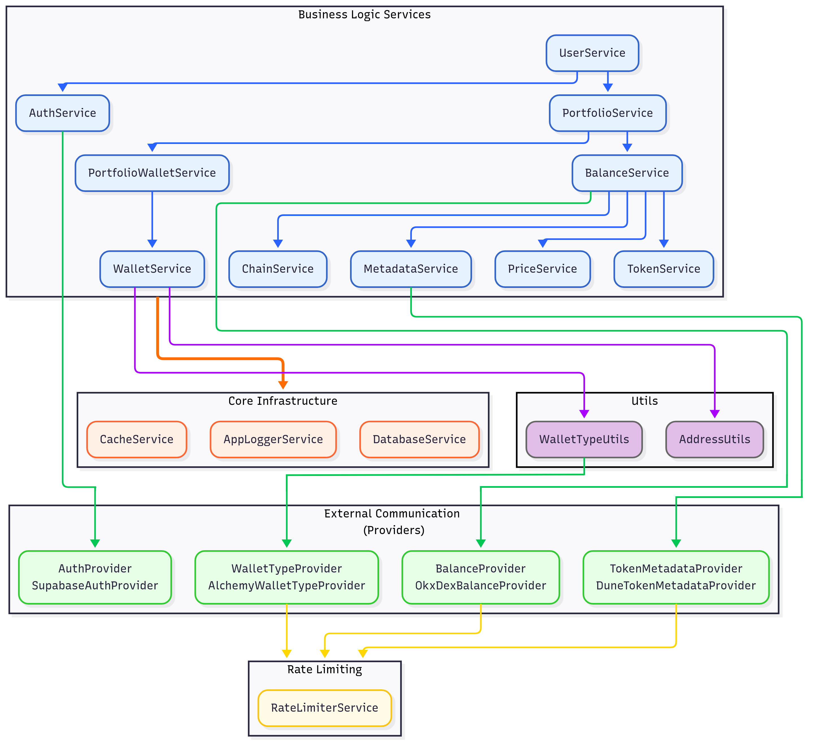

# Architectural Overview

The NextNonce backend is engineered using a sophisticated, modular architecture built on the NestJS framework. The design prioritizes scalability, maintainability, and high performance by adhering to established software engineering principles, including a strict separation of concerns, dependency injection, and a robust provider-based model for external interactions. This structure ensures that the system remains flexible and adaptable to future technological changes and feature requirements.

This document provides a high-level view of the system's architecture, focusing on the interaction between its core components.

### Core Architectural Pillars

The entire system is built upon several key architectural pillars that define its structure and behavior.

1. **The Provider Pattern (Inversion of Control)**: This is the most critical architectural concept in the backend. For every piece of logic that involves an external service (like an authentication provider or a data API) or complex, interchangeable logic (like caching), a formal `interface` is defined. Services within the application depend only on these interfaces, not on concrete implementations. The specific implementation—the `provider`—is determined at runtime via NestJS's dependency injection system. This results in:
    
    - **Decoupling & Interchangeability**: The application is not tied to any specific vendor. For example, the `AuthProvider` can be implemented by `SupabaseAuthProvider` today and a different provider tomorrow with zero changes to the consuming `AuthService`.
        
    - **High Testability**: During unit testing, it is trivial to provide a mock implementation of any provider interface. This allows services to be tested in complete isolation without making real database queries or network calls.
        
    - **Clean Code**: Vendor-specific logic (API keys, request signing, data transformation) is completely encapsulated within the provider, keeping the core business logic in the services clean and focused.
        
2. **Layered & Modular Design**: The application is organized into distinct feature modules (`AuthModule`, `PortfolioModule`, `BalanceModule`, etc.), each containing its own controllers, services, and providers. Within these modules, a clear layered architecture is enforced:
    
    - **Controllers**: A thin layer responsible only for handling HTTP requests, validating inputs via DTOs, and delegating tasks to the service layer.
        
    - **Services**: The core of the application where all business logic resides. Services orchestrate data flow, interact with the database, manage caching, and coordinate with other services and providers.
        
3. **Centralized, Multi-Layered Caching**: Performance is a key concern, addressed through an aggressive and intelligent caching strategy powered by Redis.
    
    - A central `CacheService` abstracts all caching operations, providing a consistent API for the entire application.
        
    - The system employs the **Cache-Aside Pattern**: services always check the cache first. Only on a "cache miss" is the more expensive operation (a database query or external API call) performed, with the result being stored in the cache to accelerate subsequent requests.
        
    - Caching is often multi-layered. For instance, the `AuthService` caches the `AuthUserDto`, while the `UserService` separately caches the internal `User` object. Similarly, the `BalanceService` can construct portfolio balances from the cached balances of individual wallets.
        
4. **Data Flow and Transformation (DTOs)**: The backend maintains a strict boundary between its internal data models (defined by Prisma) and the data it exposes to the outside world. Services operate on the rich internal models, but controllers always return sanitized **Data Transfer Objects (DTOs)**. This ensures a stable API contract and prevents accidental leakage of sensitive or internal-only fields.
    

### Component Breakdown

The architecture is composed of several types of components, each with a specific role.

#### Foundational Services

These services provide the core infrastructure and utilities used by all other parts of the application.

- **`DatabaseService`**: A direct extension of the `PrismaClient`, managing the database connection lifecycle and serving as the single gateway for all database operations.
    
- **`CacheService`**: The high-level interface to the caching system. It uses a `CacheProvider` to interact with Redis and provides a standardized method for generating cache keys to prevent collisions.
    
- **`RedisClientService`**: A low-level service that manages the `ioredis` client instance, handling connection, error, and retry logic.
    
- **`AppLoggerService`**: A custom logger that extends the NestJS `ConsoleLogger` to provide persistent, file-based logging for different severity levels.
    
- **`RateLimiterService`**: A generic service that orchestrates a `RateLimiterProvider` to enforce rate limits on external API calls. Crucially, this service is consumed by the _Providers_ (e.g., `AlchemyWalletTypeProvider`, `DuneTokenMetadataProvider`) to ensure that calls to external APIs are globally synchronized and rate-limited across all running instances of the backend, using Redis as the shared state.
    

#### Business Logic Services & Utilities

These services contain the application's core features and business rules.

- **`AuthService`**: Orchestrates user authentication by coordinating with the `AuthProvider` and caching the results.
    
- **`UserService`**: Manages the user lifecycle, including creation (which also triggers the creation of a default portfolio), retrieval, and deletion.
    
- **`ChainService` & `TokenService`**: These are in-memory lookup services. On application startup, they load all chain and unified token data into a map for instantaneous, synchronous access, eliminating repetitive database queries for this static data.
    
- **`WalletService`**: Responsible for creating and retrieving wallet entities. It relies on injectable utility classes: `AddressUtils` for normalizing and validating addresses, and `WalletTypeUtils` to determine if a wallet is a `SIMPLE` EOA or a `SMART` contract.
    
- **`WalletTypeUtils`**: A utility class that, in turn, uses the `WalletTypeProvider` interface to perform the external check for a smart contract.
    
- **`PortfolioService` and `PortfolioWalletService`**: Together, these manage user-specific portfolios. They handle access control, CRUD operations, and the linking/unlinking of wallets to portfolios.
    
- **`MetadataService`**: A complex orchestration service that fetches token metadata (name, symbol, logo). It uses a `TokenMetadataProvider` to get data from an external source, intelligently checks a lookup cache, and saves new token information to the database when first encountered.
    
- **`PriceService`**: Manages all token price data. It efficiently updates the latest prices and historical daily snapshots in both the cache and the database, and provides a method to calculate 24-hour price changes by reading exclusively from the cache.
    
- **`BalanceService`**: The most critical orchestration service. It synthesizes data from nearly every other service (`MetadataService`, `PriceService`, `TokenService`, `BalanceProvider`) to compute and aggregate the final, USD-valued balances for a wallet or an entire portfolio, including the logic for the "unified token" feature.
    

#### Providers: The Concrete Implementations

Providers are the concrete classes that implement the abstract interfaces and contain all vendor-specific logic.

- **`RedisCacheProvider`**: Implements the `CacheProvider` interface using `ioredis`, handling the serialization and deserialization of cached objects.
    
- **`SupabaseAuthProvider`**: Implements the `AuthProvider` interface by making API calls to the Supabase service to validate JWTs.
    
- **`OkxDexBalanceProvider` & `DuneTokenMetadataProvider`**: These implement the `BalanceProvider` and `TokenMetadataProvider` interfaces, respectively. They contain all the logic for authenticating with, signing requests for, and parsing responses from the OKX DEX and Sim Dune APIs.
    
- **`AlchemyWalletTypeProvider`**: Implements the `WalletTypeProvider` interface to determine if a wallet address is a smart contract by querying the Alchemy API.
    
- **`RedisRateLimiterProvider`**: Implements the `RateLimiterProvider` using the `rate-limiter-flexible` library backed by a dedicated Redis client.
    

### High-Level Interaction Diagram

This diagram illustrates the dependencies between the system's major components, focusing on the flow of logic between services, utilities, and providers. Core infrastructure services like `DatabaseService`,`CacheService` and `AppLoggerService` are used by most services.

