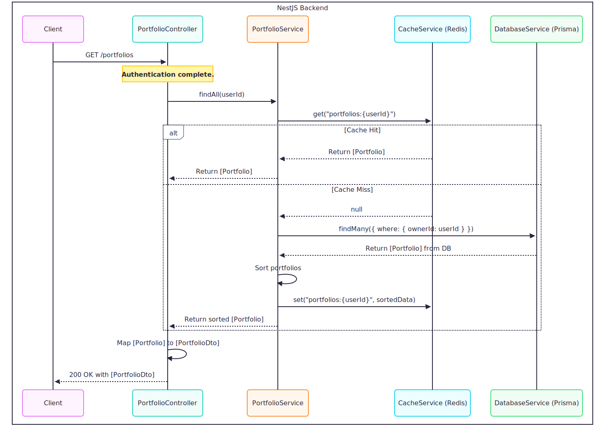

# Standard Request Flow (Post-Authentication)

This document outlines the typical lifecycle of a request after it has successfully passed the initial security checks detailed in the **[Authentication](auth.md)**. At this stage, the request is confirmed to be from a valid, authenticated user, and a secure, internal `User` object has been attached to the request context.

The architecture of the NextNonce backend is designed to be robust, scalable, and maintainable by strictly adhering to core **NestJS principles**:

- **Modularity**: The application is divided into distinct feature modules (e.g., `PortfolioModule`).
    
- **Separation of Concerns**: Each class has a single, well-defined responsibility (Controllers for routing, Services for business logic, Providers for external communication).
    
- **Dependency Injection (DI)**: Components declare their dependencies, and the NestJS runtime injects them, promoting loose coupling and high testability.
    

The following sections explain the flow through the controller and service layers.

### 1. The Controller Layer: The Entry Point

The request's journey through the business logic begins at the controller. The controller acts as a thin routing layer, responsible for handling the HTTP request and delegating work, but containing no actual business logic itself.

```ts
// Example: src/portfolio/portfolio.controller.ts
@Controller('portfolios')
export class PortfolioController {
    // ... constructor injects portfolioService ...

    @Get()
    async findAll(@CurrentUser() user: User): Promise<PortfolioDto[]> {
        // 1. Delegate to the service
        const portfolios: Portfolio[] = await this.portfolioService.findAll(user.id);

        // 2. Transform the result to a DTO
        return portfolios.map(/* ... */);
    }
}
```

**Key Responsibilities:**

- **Routing and Input Handling**: It uses decorators like `@Controller`, `@Get`, `@Param`, and `@CurrentUser` to map HTTP requests to methods and extract necessary data.
    
- **Delegation**: It immediately calls the appropriate service to handle the business logic, adhering to the "Thin Controller, Fat Service" principle.
    
- **Response Shaping**: After receiving data from the service, it maps the internal models to public-facing DTOs before sending the response.
    

### 2. The Service Layer: The Business Logic Core

The service layer is where the actual work happens. A service class is an injectable provider that encapsulates a feature's business logic.

#### General Service Structure

A typical service in the application is structured to declare all its dependencies via constructor-based dependency injection.

```ts
@Injectable()
export class SomeService {
    private readonly logger: AppLoggerService;
    constructor(
        // Core dependencies
        private readonly databaseService: DatabaseService,
        private readonly cacheService: CacheService,

        // Dependencies on other services
        private readonly anotherService: AnotherService,

        // Dependencies on external providers
        @Inject(SOME_THING_PROVIDER)
        private readonly someThingProvider: SomeThingProvider,
    ) {
        this.logger = new AppLoggerService(SomeService.name);
    }

    // ... service methods
}
```

Within its methods, a service acts as an **orchestrator**. It uses its injected dependencies to execute the required logic. A single service method might:

- Query the `CacheService` to check for existing data.
    
- Call the `DatabaseService` to fetch the data from the source of truth.
    
- Invoke methods on `anotherService` to perform related sub-tasks.
    
- Call the `someThingProvider` to fetch data from an external API.
    
- Use standalone utility functions for data manipulation, calculation, or transformation.
    

This structure keeps logic encapsulated and makes the components highly reusable and testable.

#### Concrete Example: `PortfolioService`

The `findAll` method in the `PortfolioService` demonstrates this pattern clearly.

```ts
// src/portfolio/portfolio.service.ts
@Injectable()
export class PortfolioService {
    // ... constructor ...

    async findAll(userId: string): Promise<Portfolio[]> {
        // 1. Check Cache First
        const cacheKey = this.cacheService.getCacheKey(/* ... */);
        const cachedPortfolios = await this.cacheService.get(cacheKey);
        if (cachedPortfolios) {
            return cachedPortfolios; // Return immediately if cache hit
        }

        // 2. Fetch from Source of Truth (Database)
        const portfolios = await this.databaseService.portfolio.findMany(/* ... */);

        // 3. Perform Business Logic/Data Manipulation
        const sortedPortfolios = portfolios.sort(/* ... */);

        // 4. Update the Cache
        await this.cacheService.set(cacheKey, sortedPortfolios, /* ... */);

        // 5. Return the final data
        return sortedPortfolios;
    }
}
```

This method perfectly illustrates the **Cache-Aside Pattern**, a standard performance optimization strategy used throughout the application. The service first checks the cache, and only performs the more expensive database query on a "cache miss," ensuring optimal response times for frequently accessed data.

### Sequence Diagram

This diagram visualizes the flow for the `GET /portfolios` request, covering both cache hit and cache miss scenarios.


