The NextNonce application is built upon a modern, multi-layered **Clean Architecture** adapted for Kotlin Multiplatform. The primary goal of this architecture is to create a clean separation of concerns, ensuring the application is scalable, testable, and maintainable. A key principle is maximizing shared code, with nearly all business logic, data handling, and UI residing in the `commonMain` source set.

The architecture is divided into three core layers: **Data**, **Domain**, and **Presentation**.

-----

### Data Layer

The **Data Layer** is responsible for all data operations. It acts as the single source of truth for the application's data, abstracting away the origins of the data, whether it's from a remote server or a local database.

Its main components are:

  - **Repositories (`...RepositoryImpl.kt`):** These are the concrete implementations of the repository interfaces defined in the Domain Layer. They orchestrate the flow of data from one or more data sources, handle caching logic, and map data models.
  - **Data Sources:**
      - **Remote (`Remote...DataSource.kt`):** These interfaces and their implementations handle communication with the backend API using Ktor. They are responsible for making network calls and parsing the responses (DTOs).
      - **Local (`...Dao.kt`):** These are Data Access Objects (DAOs) provided by Room. They define the contract for interacting with the on-device SQLite database for caching purposes.
  - **Data Transfer Objects (DTOs):** These are simple data classes used exclusively for serializing and deserializing network responses with `kotlinx.serialization`.
  - **Mappers:** These are extension functions responsible for converting data models between layers (e.g., from a network DTO or a database entity to a Domain Model).

-----

### Domain Layer

The **Domain Layer** is the heart of the application. It contains the core business logic and rules. Crucially, this layer is pure Kotlin and has no dependencies on any other layer's implementation details (like the UI framework or networking library).

Its main components are:

  - **Repositories (`...Repository.kt`):** These are *interfaces* that define the contracts for the Data Layer. The Domain Layer depends on these abstractions, not on the concrete `RepositoryImpl` classes. This inversion of control is central to Clean Architecture.
  - **Use Cases (`...UseCase.kt`):** Each Use Case represents a single, specific business operation (e.g., `GetWalletTotalBalanceUseCase`, `CreateUserUseCase`). They are called by ViewModels and orchestrate the flow of data from repositories to achieve a specific goal.
  - **Models (`...Model.kt`):** These are the core business objects of the application (e.g., `WalletModel`, `PortfolioModel`). They represent the essential data structures and are used across all layers.

-----

### Presentation Layer

The **Presentation Layer** is responsible for displaying data on the screen and handling all user interactions. In this project, the entire Presentation Layer is built with **Compose Multiplatform**, allowing the UI to be fully shared between Android and iOS.

Its main components follow a **Model-View-ViewModel (MVVM)** pattern with a Unidirectional Data Flow (UDF):

  - **Screens (`...Screen.kt`):** These are the `@Composable` functions that build the UI for a specific feature. They are stateless, meaning they simply observe the state from the ViewModel and render it.
  - **ViewModels (`...ViewModel.kt`):** These classes contain the presentation logic. They call Use Cases to perform actions, receive the results, and transform the data into a UI-friendly `State`.
  - **State (`...State.kt`):** A `data class` that represents the entire state of a screen at any given moment. It typically includes loading flags, data to be displayed, and any error messages. The UI observes this state object and re-renders when it changes.
    ```kotlin
    data class WalletState(
        val isLoading: Boolean = true,
        val uiWalletInfo: UIWalletInfo? = null,
        val uiWalletTotalBalance: UIWalletTotalBalance = UIWalletTotalBalance(),
        val assetBalances: List<UIAssetBalanceListItem> = emptyList(),
        val error: StringResource? = null,
    )
    ```
  - **UI Models (`UI...Item.kt`):** These are simple data classes tailored specifically for display in the UI. Domain Models are mapped to these UI Models to separate concerns and avoid cluttering business objects with UI-specific annotations or logic.

-----

### Features & Navigation Flow

The application is structured around a set of core features, each with its own dedicated package containing its data, domain, and presentation components. The main features include:

  - **Start & Authentication**
  - **Home Dashboard**
  - **Portfolio Management**
  - **Wallet Details**
  - **Add New Wallet**

The navigation between these features is handled by **Compose Navigation**, ensuring a seamless and type-safe user journey. For a detailed explanation of the navigation graph, see the **[Navigation](./navigation.md "null")** documentation.

The high-level user flow can be visualized as follows:



